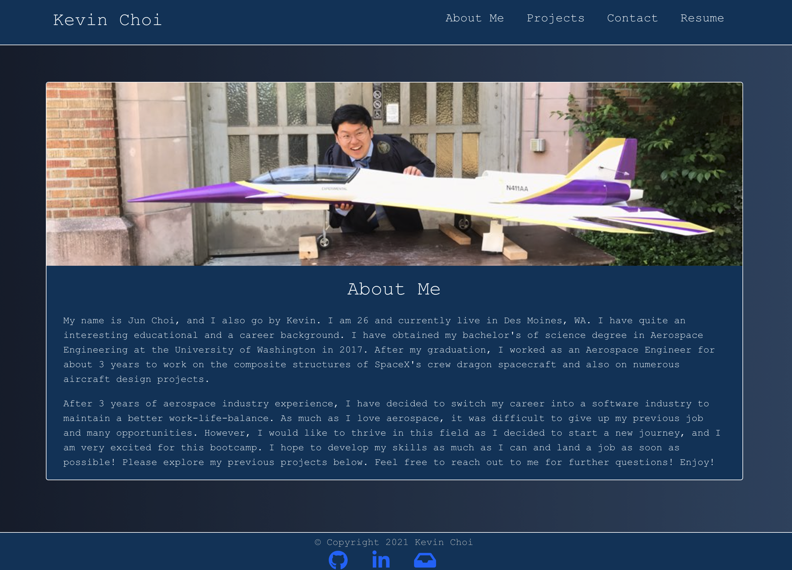
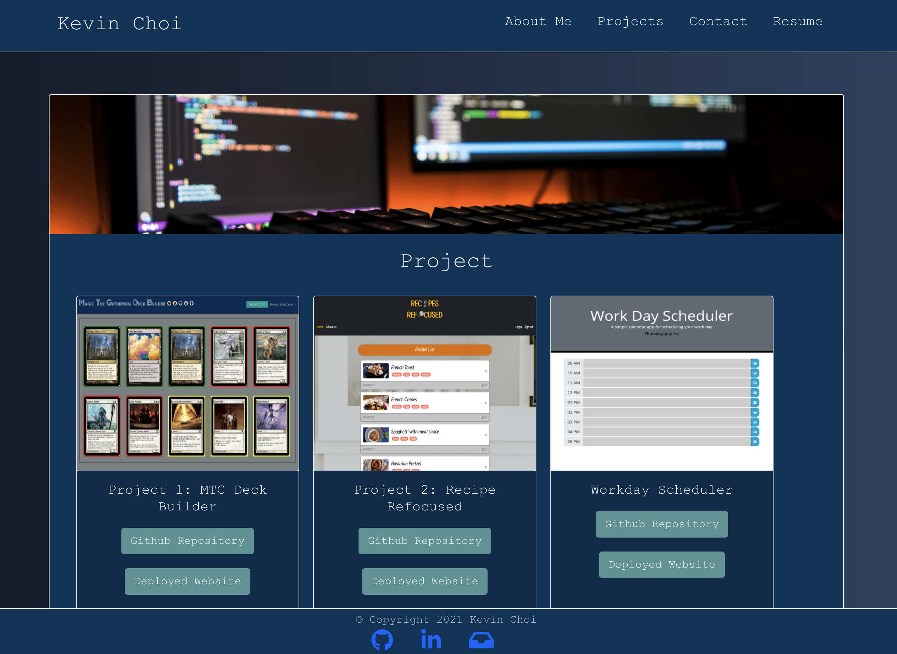
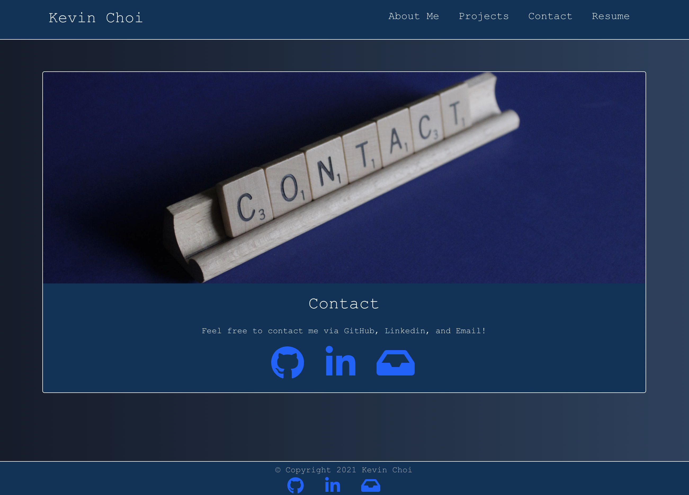

# React-Portfolio
Deployed Link: https://kevchoice.herokuapp.com/

  [](https://opensource.org/licenses/MIT)

  ## Description
  This is my portfolio that was created by using the React technology. When user try to access certain sections through navbar, the page does not reload and take user to the section. React is powerful front-end tool to reflect update and much faster. In this portfolio, you will be able to access my introduction and background as well as the projects I have worked on throughout the bootcamp. Also, I have included my contact information and resume. Feel free to contact me and please enjoy my portfolio!

  ## Table of Contents
  * [Usage](#usage)
  * [License](#license)
  * [Contributing](#contributing)
  * [Tests](#tests)
  * [Questions](#questions)

  ## Usage
  Click the `deployed link` above to access to my portfolio.
  - Homepage (About Me)

  - Projects

  - Contact

  
  ## License
  This project is covered under MIT License.

  <details>
    <summary>
      See License
    </summary> 
  
  ```
  Copyright <2021> <Kevin Choi>

  Permission is hereby granted, free of charge, to any person obtaining a copy of this software and associated documentation files (the "Software"), to deal in the Software without restriction, including without limitation the rights to use, copy, modify, merge, publish, distribute, sublicense, and/or sell copies of the Software, and to permit persons to whom the Software is furnished to do so, subject to the following conditions:
  The above copyright notice and this permission notice shall be included in all copies or substantial portions of the Software.
  
  THE SOFTWARE IS PROVIDED "AS IS", WITHOUT WARRANTY OF ANY KIND, EXPRESS OR IMPLIED, INCLUDING BUT NOT LIMITED TO THE WARRANTIES OF MERCHANTABILITY, FITNESS FOR A PARTICULAR PURPOSE AND NONINFRINGEMENT. IN NO EVENT SHALL THE AUTHORS OR COPYRIGHT HOLDERS BE LIABLE FOR ANY CLAIM, DAMAGES OR OTHER LIABILITY, WHETHER IN AN ACTION OF CONTRACT, TORT OR OTHERWISE, ARISING FROM, OUT OF OR IN CONNECTION WITH THE SOFTWARE OR THE USE OR OTHER DEALINGS IN THE SOFTWARE.
  ```
  </details>
  

  ## Contributing
  No contribution will be accepted at this moment.

  ## Tests
  There are no test available in this application.

  ## Questions
  If you have any questions, please contact me via

  * Email: [kevchoi1028@gmail.com](mailto:kevchoi1028@gmail.com)

  * GitHub: [https://github.com/rhwlffk1028](https://github.com/rhwlffk1028)

  * Linkedin: [https://linkedin.com/in/kevchoi](https://linkedin.com/in/kevchoi)
